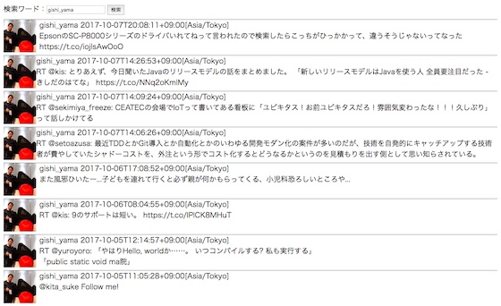

# Javaを体験してみよう

Twitterクライアントの作成を通じて、Javaの基本的な特徴を体験してみましょう。

時間が限られているため、文法的な解説はあまり行いません。

様々な部品プログラム（クラスやそこから作られるオブジェクト）を作成したり組み合わせることで、利用環境に応じたアプリケーションを作れるイメージを掴んでもらえれば幸いです。

1. [Twitterの情報を取得する](./doc/Part01.md)
2. [WebでTwitter検索アプリを作る](./doc/Part02.md)
3. [PC内でTwitter検索アプリを作る](./doc/Part03.md)

