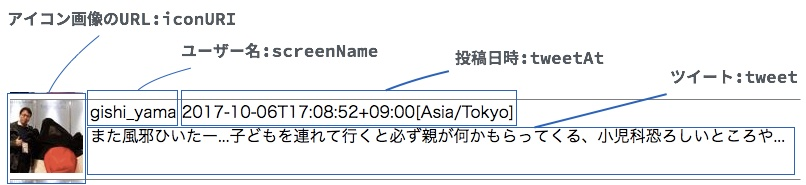

# Part1 Twitterの情報を取得する

部品のプログラムを組み合わせて、Twitter検索できるプログラムを作りましょう。

Twitter検索には、皆さんがそれぞれ作る部品プログラムと、Twitter4Jという外部部品プログラムをつくります。

できるだけコピー＆ペーストはせずに、自分の手で複写してみましょう。

コメントアウト(// の文章）は複写しなくても大丈夫です。

## Twitterのユーザー名（ScreenName)の役割の部品プログラムを作る

main/javaフォルダの `com.example.value.ScreenName.java` を下のようにプログラミングしましょう。

```java
package com.example.value;

import static java.util.Objects.requireNonNull;

public class ScreenName {

  // Twitterのユーザ名（ScreenName）は15文字まで
  private static final int MAX_LENGTH = 15;

  // 管理するデータ
  private String value;

  // データの初期化
  public ScreenName(String arg0) {
    requireNonNull(arg0);
    validate(arg0);
    value = arg0;
  }

  // データの整合性チェック
  private void validate(String arg0) {
    if (arg0.length() > MAX_LENGTH) {
      throw new IllegalArgumentException("value は " + MAX_LENGTH + "字以内:" + arg0);
    }
  }

  // データの取り出し
  public String getValue() {
    return value;
  }
}

```

## Twitterのツイート文章（Tweet）の役割の部品プログラムを作る

main/javaフォルダの `com.example.value.Tweet.java` を下のようにプログラミングしましょう。

```java
package com.example.value;

import static java.util.Objects.requireNonNull;

public class Tweet {

  // 送信できる文字は140字だが、受信できる文字は140字とは限らないので、2倍に仮定
  private static final int MAX_LENGTH = 280;

  // 管理するデータ
  private String value;

  // データの初期化
  public Tweet(String arg0) {
    requireNonNull(arg0);
    validate(arg0);
    value = arg0;
  }

  // データの整合性チェック
  private void validate(String arg0) {
    if (arg0.length() > MAX_LENGTH) {
      throw new IllegalArgumentException("value は " + MAX_LENGTH + "字以内:" + arg0);
    }
  }

  // データの取り出し
  public String getValue() {
    return value;
  }
}

```

## ツイッターのタイムラインの部品プログラムを作る

上で作ったScreenName, Tweetの部品プログラム、Javaの標準の部品プログラムを組み合わせて作ります。



main/javaフォルダの `com.example.repository.TimeLineBlock.java` を下のようにプログラミングしましょう。

```java
package com.example.repository;

import com.example.value.ScreenName;
import com.example.value.Tweet;
import twitter4j.Status;
import twitter4j.User;

import java.net.URI;
import java.time.Instant;
import java.time.ZoneId;
import java.time.ZonedDateTime;
import java.util.Objects;

import static java.util.Objects.requireNonNull;

public class TimeLineBlock {

  // タイムラインを構成する部品プログラム
  private final Tweet tweet;
  private final ScreenName screenName;
  private final URI iconURI;
  private final ZonedDateTime tweetAt;

  // データの初期化
  public TimeLineBlock(Status status) {
    requireNonNull(status);
    tweet = new Tweet(status.getText());

    User user = status.getUser();
    screenName = new ScreenName(user.getScreenName());
    iconURI = URI.create(user.getBiggerProfileImageURL());

    Instant instant = status.getCreatedAt().toInstant();
    tweetAt = instant.atZone(ZoneId.systemDefault());
  }

  // URIデータを文字列で呼び出し
  public String getIconUrI() {
    return iconURI.toString();
  }

  // URIデータの拡張子を呼び出し
  public String getExtention() {
    String uri = iconURI.toString();
    int index = uri.lastIndexOf(".") + 1;
    String extension = uri.substring(index);
    return Objects.equals(extension, "jpeg") ? "jpg" : extension;
  }

  // タイムラインの文章部分を文字列で呼び出し
  public String getBlockMessage() {
    return String.format("%s\t%s\n%s",
      screenName.getValue(), tweetAt.toString(), tweet.getValue());
  }

}

```

## Twitterに接続する役割の部品プログラムをつくる

Twitterにアクセスして、上のTimeLineBlockの部品プログラムに情報をいれるプログラムを作りましょう。

main/javaフォルダの `com.example.repository.TwitterRepository.java` を下のようにプログラミングしましょう。

`****` の部分は、自分でTwitterのサイトから取得したものに変えて下さい。

[参考：Twitter API キーの取得手順](http://dotnsf.blog.jp/archives/1044796238.html)

Name, Description, WebSiteは何でもよいのですが、思いつかなければ下をいれてください。

- Name
  - javado_test
- Description
  - javado_test
- WebSite
  - https://javado.connpass.com/ 

```java
package com.example.repository;

import twitter4j.Query;
import twitter4j.Twitter;
import twitter4j.TwitterException;
import twitter4j.TwitterFactory;
import twitter4j.conf.ConfigurationBuilder;

import java.util.List;

import static java.util.Collections.emptyList;
import static java.util.Objects.requireNonNull;
import static java.util.stream.Collectors.toList;

public class TwitterRepository {

  // Twitterへの認証情報
  private static final String CONSUMER_KEY = "****";
  private static final String CONSUMER_SECRET = "****";
  private static final String ACCESS_TOKEN = "****";
  private static final String ACCESS_TOKEN_SECRET = "****";

  // Twitter4J（Twitterにアクセスする役割の外部部品プログラム）
  private Twitter twitter;

  // データの初期化
  public TwitterRepository() {
    ConfigurationBuilder cb = new ConfigurationBuilder();
    cb.setDebugEnabled(true)
      .setOAuthConsumerKey(CONSUMER_KEY)
      .setOAuthConsumerSecret(CONSUMER_SECRET)
      .setOAuthAccessToken(ACCESS_TOKEN)
      .setOAuthAccessTokenSecret(ACCESS_TOKEN_SECRET);
    twitter = new TwitterFactory(cb.build()).getInstance();
  }

  // Twitterから limit 件、word での検索結果を取り出し、TimeLineBlock部品に情報をいれる
  public List<TimeLineBlock> getTimeLineBlocks(int limit, String word) throws TwitterException {
    requireNonNull(word);
    if (word.isEmpty()) {
      return emptyList();
    }
    System.out.println("get status...");
    return twitter.search(new Query(word))
      .getTweets()
      .stream()
      .filter(s -> !s.getUser().isProtected())
      .limit(limit)
      .map(TimeLineBlock::new)
      .collect(toList());
  }

}
```

## 動作確認

プロジェクトのトップフォルダで右クリックし、「依存性でビルド」を選びます。

インターネットから必要なファイルがダウンロードされてビルド（コンパイル）されます。

test/java フォルダの `com.example.Test` を右クリックして実行しましょう。

※もしうまくいかない人は、

```java
public static void main(String[] args) {
 ...  
}
``` 

を一度コメントアウト（ /* */でかこう）して保存、コメントアウトを外して保存をしてみてください。


コンソールにツイートらしきものが表示されれば成功（のはず）です。
